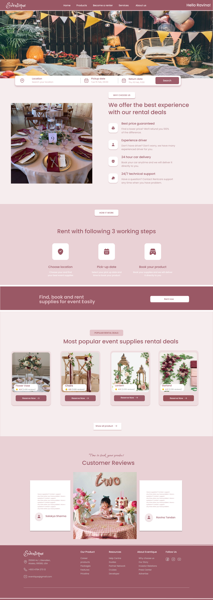
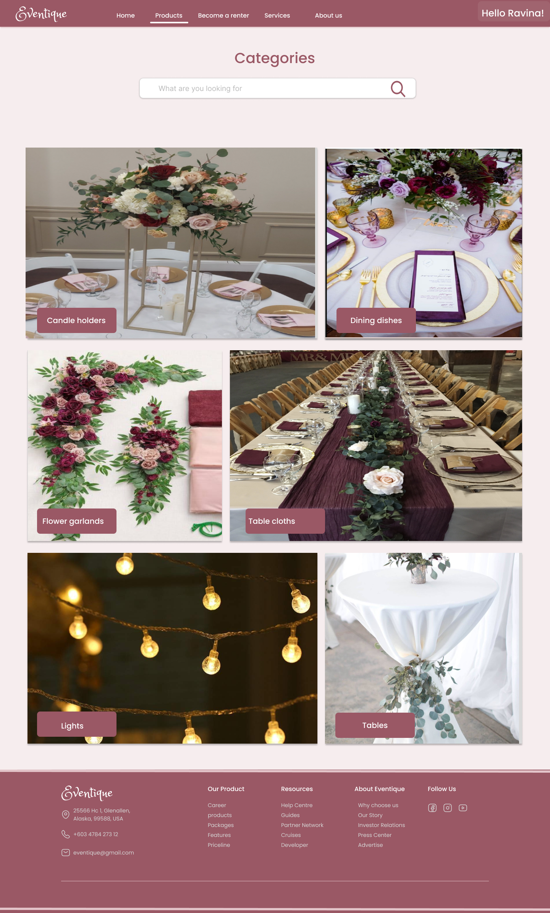
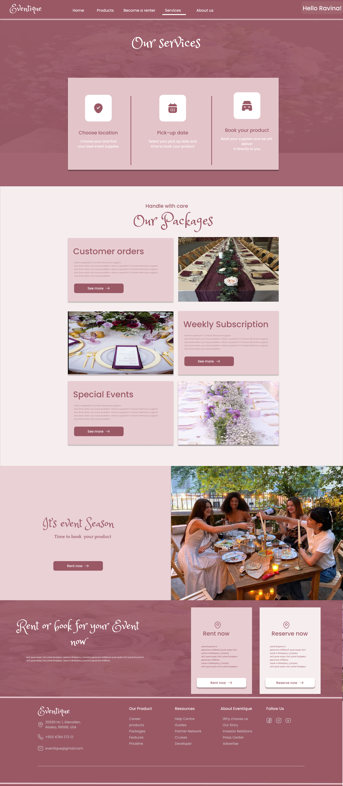

# EventRentify – Frontend

This is the React-based frontend of **EventRentify**, a full-stack web application built to centralize and simplify the event rental process in Nepal. The platform allows users to rent or offer event-related items like culinary equipment, furniture, and décor, all through an intuitive and responsive user interface.

---

## 🎯 Project Overview

The platform supports three user types: **Users**, **Vendors**, and **Admins**, each with dedicated features:

### 👥 Users Can:
- Browse items by category
- View item details with availability
- Add to cart and book items
- Submit their own items for rent
- Track orders and booking history
- Get real-time booking and request status updates

### 🛠️ Admins Can:
- Manage users, vendors, and item listings
- Monitor all bookings and order histories
- Approve, edit, or remove items and categories
- Oversee user reviews, complaints, and platform content

### 🛍️ Vendors Can:
- Submit request for their rentable items
- View and manage booking requests
- Track item return dates and customer interactions
- Update availability and respond to customer needs

---

## 🧠 Design Approach

This interface was built following a structured user-centered design process:
- Conducted user research and problem discovery
- Created user personas, user stories, and flow diagrams
- Designed low- and high-fidelity wireframes using Figma
- Applied Nielsen’s 10 Usability Heuristics in component development
- Performed user testing (Wizard of Oz & guerrilla methods)
- Iterated designs based on direct feedback from test users

---

## 🛠️ Tech Stack

- **React.js**
- **React Router**
- **CSS**
- **Axios** 

---

## 🎥 UX & Design Process

- 🎨 **Figma Wireframes & Prototypes**  
  [View on Figma](https://www.figma.com/design/KjCDnKzXKd1XKKaiKJR6pI/)

- 📹 **User Testing Video**  
  [Watch on YouTube](https://youtu.be/BSmKs01Nfjw)

---

## 🖼 **Sample Screenshots**

  
  &nbsp;
  

    
  &nbsp;
  
   

 okay tell me why is the third picture slightly below than 4th one

---

> This frontend reflects thoughtful UX design and real-world problem-solving. Built with usability and business needs in mind, it balances functionality with clarity and ease of use.

[🔙 Back to Full Secure Project Repo](https://github.com/purnimabohara/EventRentify_Secure_Full_Project)
